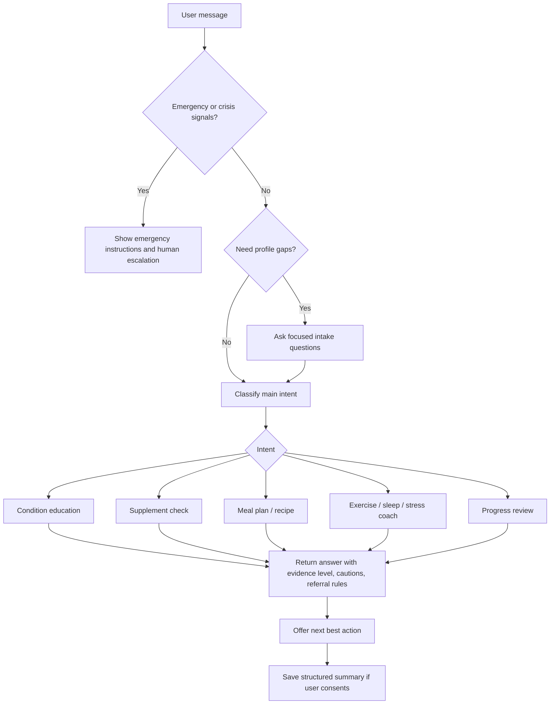
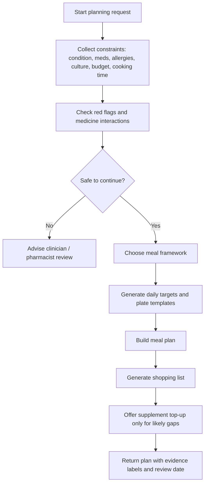

# Natural Health Advisor Chatbot Portfolio Upgrade

## Executive summary

The strongest portfolio direction is **not** a generic “natural remedies” bot. It is a **safety-first, evidence-graded, culturally adaptable lifestyle and self-management coach** that is explicit about what works well, what is only weakly supported, what may interact with medicines, and when a person needs a clinician instead of a chatbot. That positioning is much more defensible clinically and commercially because lifestyle interventions have meaningful evidence for blood pressure, cardiovascular risk, type 2 diabetes prevention and management, obesity, some depressive symptoms, and some chronic pain pathways, while guidance for autoimmune disease and supplements is usually more cautious or adjunctive. citeturn38search2turn38search13turn21search1turn30search0turn31search0turn23view1turn23view0turn32view0turn19search2

The second strategic choice is to make the assistant **transparent about evidence strength**. Users should always see a compact label such as **Strong evidence**, **Moderate evidence**, **Limited evidence**, or **Not recommended / insufficient evidence**. That matters because “natural” does not mean safe: supplements can interact with medicines, can be contaminated or adulterated, and are not approved like medicines for safety and effectiveness before marketing in some jurisdictions. citeturn18search2turn18search4turn18search15turn18search21

The third strategic choice is to design the product so that it can safely remain an **educational and self-management support tool**, unless you deliberately decide to pursue medical-device-grade functionality. In the UK, US, and EU, software that performs medical purposes or drives treatment decisions can fall into medical-device or clinical-decision-support regulation; in the UK/EU, health data also requires special handling, and WCAG 2.2 is the right accessibility baseline. citeturn14search2turn14search6turn14search3turn16search0turn16search15turn15search3turn15search6turn14search8turn39search0turn39search4

If you build around those three ideas, the section of your portfolio will look rigorous rather than trendy: **useful for prevention and self-care, honest about limitations, and operationally safe**. citeturn18search2turn23view4turn37view1turn36search3

## Prioritised feature roadmap

The first release should optimise for trust, clinical usefulness, and controlled scope rather than breadth. The order below reflects both user value and implementation risk. The highest-priority features are those that reduce harm, improve answer quality, and make the experience feel genuinely personalised instead of generic. That priority order aligns with current guideline logic on shared decision-making, stepped care, non-stigmatising communication, and safe escalation. citeturn22view0turn26view0turn29search6turn15search6turn14search2

| Priority | Feature | Why it matters | What “good” looks like in the chatbot |
|---|---|---|---|
| P0 | Safety triage and escalation layer | Without this, the bot risks handling emergencies, medication harms, suicidality, hypertensive crises, or autoimmune flares too casually. | First-turn red-flag screen, crisis copy, local emergency instructions, clinician referral triggers, suppression of unsafe “natural” advice. |
| P0 | Evidence engine with visible evidence labels | Users need to know whether advice is guideline-backed or just plausible. | Every recommendation tagged **Strong / Moderate / Limited / Not recommended**, with a plain-language reason. |
| P0 | Personalisation intake | Good natural-health advice depends on conditions, medicines, allergies, pregnancy status, culture, budget, and access to food. | Structured intake plus reusable profile memory with opt-in retention. |
| P1 | Condition modules for the major disease clusters | This is the core utility layer the user asked for. | Disease-specific flows for CVD, hypertension, type 2 diabetes, obesity, common mental health conditions, chronic pain, metabolic syndrome, and autoimmune support. |
| P1 | Supplement and interaction checker | Supplement questions are common and high risk. | Food-first guidance, dose ranges, interaction prompts, clinician referral when iron, iodine, anticoagulants, pregnancy, kidney disease, or immunosuppression are involved. |
| P1 | Meal-plan and recipe engine | Daily planning is where users convert ideas into action. | Condition-aware meal plans, shopping lists, prep methods, and recipe swaps by allergy, culture, and budget. |
| P1 | Behaviour-change coach | Advice fails without adherence support. | Weekly goals, habit tracking, relapse plans, motivational interviewing tone, household-support prompts. |
| P1 | Non-stigmatising UX and multilingual support | Weight and mental health content can alienate users if handled badly. | Permission-based weight discussions, plain English, adjustable reading level, localisation of foods and units, translation layer. |
| P2 | Accessibility and multimodal content | This widens reach and demonstrates product maturity. | WCAG 2.2 AA, captions, keyboard support, screen-reader labels, audio scripts, printable plans, simplified summaries. |
| P2 | Clinician handoff and EHR-ready architecture | This makes the chatbot “real-world deployable” rather than demo-only. | SMART on FHIR launch, exportable summary, CarePlan/Goal/Observation mapping, CDS Hooks for clinician review. |
| P2 | Content studio | Your portfolio becomes much stronger if the same knowledge can produce several useful artefacts. | Short answers, long-form articles, meal plans, shopping lists, guided audio, recipe cards, and progress summaries from one evidence base. |

A strong portfolio narrative is therefore: **“I designed an evidence-aware lifestyle-support chatbot with medical-safety rails, condition-specific coaching, food-first nutrition logic, and standards-based interoperability.”** That sounds materially stronger than **“I built a natural health chatbot.”**

## Clinical knowledge architecture

The right clinical model is a **layered knowledge architecture**:

1. **Foundation layer:** risk factors common across conditions — food quality, sodium, body weight, physical activity, sleep, alcohol, tobacco, stress, self-monitoring, and social connection.  
2. **Condition layer:** disease-specific education, contraindications, symptom red flags, and escalation rules.  
3. **Medication / supplement layer:** interaction checks, duplication warnings, and “do not stop clinician-prescribed therapy” rules.  
4. **Action layer:** answer formats that become plans, shopping lists, recipes, trackers, and handoff summaries. citeturn38search13turn40search0turn23view4turn32view3turn37view1turn36search3

Use this evidence legend in the product:

- **Strong evidence** — supported by major guidelines and consistent trial/meta-analysis evidence.  
- **Moderate evidence** — reasonably consistent evidence, but effects are smaller, more context-dependent, or more adjunctive.  
- **Limited evidence** — some supportive studies, but not reliable enough for broad claims.  
- **Not recommended / insufficient** — evidence is weak, inconsistent, or guidance advises against routine use.

The disease modules should look like this:

| Topic | What the chatbot should do | Evidence-aware priorities | Contraindications, limits, and referral logic | Sources |
|---|---|---|---|---|
| Cardiovascular disease | Focus on prevention, secondary-risk reduction, diet quality, exercise progression, smoking and alcohol advice, sleep, weight, and medication adherence support. | Prioritise Mediterranean-style eating, regular aerobic and strength activity, tobacco avoidance, sleep hygiene, and BP/lipid/glucose management. Evidence is strongest for dietary pattern and risk-factor control, not for “heart-protective” supplements as a substitute for guideline care. | Do **not** imply supplements can replace statins, antihypertensives, or antiplatelets. Urgent escalation for chest pain, syncope, acute dyspnoea, stroke symptoms, or exertional symptoms suggesting unstable disease. | citeturn21search1turn21search21turn38search13turn38search0turn38search6turn40search0 |
| Type 2 diabetes | Teach sustainable glycaemic self-management, eating-pattern choice, weight-loss logic, activity, foot-risk awareness, and glucose-monitoring literacy. | Prioritise evidence-based eating patterns, weight reduction when relevant, 150+ minutes of activity weekly, resistance work, and breaking up sitting every 30 minutes. Use medicine-aware caution if the user uses insulin or sulfonylureas. | Do **not** promise remission from supplements. Escalate for severe hyperglycaemia symptoms, vomiting, ketones, recurrent hypoglycaemia, foot ulcers, new vision loss, or pregnancy. | citeturn30search0turn30search9turn30search10turn31search0turn31search9turn20search11 |
| Hypertension | Teach home BP technique, sodium reduction, potassium-rich food choices, weight loss, activity, alcohol moderation, and medication adherence support. | Prioritise low-sodium eating, DASH-style plans, potassium from foods, exercise, home blood-pressure monitoring, and annual review prompts. | Potassium salt substitutes are **not** for everyone: avoid casual recommendation in kidney disease, pregnancy, diabetes, older age, or with ACE inhibitors / ARBs unless clinician-approved. Escalate for very high readings with symptoms such as neurological change, severe headache, chest pain, or breathlessness. | citeturn23view5turn23view3turn13search3turn13search9turn20search1turn20search19turn40search2 |
| Obesity | Use a chronic-disease, non-stigmatising model with long-term support, energy deficit, behaviour techniques, sleep, and binge-eating screening. | Prioritise multicomponent behaviour programmes, realistic goals, long-term follow-up, household support, culturally sensitive planning, and structured low-energy approaches only with ongoing support. | Ask permission before discussing weight; avoid blame and diagnostic overshadowing. Escalate for suspected eating disorder, unexplained rapid weight loss, pregnancy-related issues, severe depression, or obesity comorbidities needing specialist input. | citeturn22view2turn26view0turn29search2turn29search6turn28search2 |
| Common mental health conditions | Cover low-intensity options, behavioural activation, group exercise, mindfulness, sleep, routine, social connection, and escalation to formal care. | For less severe depression, guided self-help, behavioural activation, group exercise, and group mindfulness / meditation are useful first-line options. For more severe depression, combined therapy and antidepressant treatment often belongs in the choice set. Exercise has meaningful evidence for symptom reduction, but not as a replacement for urgent care. | Escalate immediately for suicidality, psychosis, mania, inability to care for self, severe functional collapse, or safeguarding concerns. For anxiety, use stepped care and digital/self-help only when the presentation is suitable. | citeturn32view0turn32view1turn32view2turn32view3turn19search2turn19search6turn33search0turn33search9 |
| Chronic pain | Reframe around self-management and function, not cure claims. Separate chronic **primary** pain from pain secondary to clear pathology where disease-specific care matters. | Prioritise supervised group exercise, staying active, ACT/CBT for pain, and a cautious single course of acupuncture for chronic primary pain. | For chronic primary pain, NICE explicitly advises **not** initiating opioids, NSAIDs, paracetamol, benzodiazepines, ketamine, or gabapentinoids. Escalate for red-flag back pain, new neurological deficit, bowel/bladder change, fever, cancer concern, or acute swollen hot joint. | citeturn23view1turn23view0turn23view2turn37view0turn37view1turn37view2 |
| Metabolic syndrome | Treat this as a risk cluster rather than a separate “natural disease”. The bot should connect waist, glucose, BP, lipids, inactivity, and sleep. | Prioritise the same core package used for hypertension, obesity, and diabetes risk: Mediterranean/DASH-like eating, regular activity, strength work, sleep, weight reduction, and smoking cessation. | Avoid “detox” framing. Encourage clinician follow-up for full cardiometabolic work-up when multiple features cluster or labs are absent. | citeturn4search1turn38search13turn38search0turn40search7turn40search2 |
| Common autoimmune conditions | Position lifestyle support as **adjunctive**, not disease-modifying replacement therapy. Build separate modules for rheumatoid arthritis, lupus, psoriatic disease, and inflammatory bowel support rather than one vague “autoimmune” mode. | Prioritise smoking cessation, regular activity, symptom pacing, balanced diet, sleep, stress reduction, and condition-specific self-care such as sun protection in lupus. | Do **not** tell users to stop DMARDs, steroids, biologics, or other prescribed immunomodulators. Escalate for fever on immunosuppression, suspected infection, chest pain, renal symptoms, severe flare, or pregnancy-related questions. | citeturn34search5turn34search11turn34search0turn35view0turn36search0turn36search3turn36search4turn36search1 |

The most important content rule is this: **every answer should include four blocks** — **what helps**, **how strong the evidence is**, **who should be careful**, and **when to refer**. That structure makes the chatbot more clinically legible and much safer.

## Nutrition, supplementation and meal design

Your nutrition layer should be explicitly **food-first, supplement-second, deficiency-aware, and medication-aware**. WHO’s current healthy-diet guidance emphasises varied nutrient-dense foods, while NIH supplement resources and NCCIH material make clear that supplements are useful in selected situations but can interact with medicines and can be harmful at high doses or when poor-quality products are used. citeturn39search1turn13search4turn18search2turn18search4

A practical supplement table for deployment is below. These ranges are best thought of as **maintenance / top-up guidance**, not treatment protocols for diagnosed deficiency.

| Nutrient | When the chatbot may discuss it | Food-first guidance | Practical dose framing | Main interactions / cautions | Sources |
|---|---|---|---|---|---|
| Vitamin D | Low sun exposure contexts, older adults, bone health, winter-time questions, or clinician-confirmed low status. | Use foods and fortified products where available; ODS notes fatty fish and fortified foods are major sources. | ODS RDA is 600 IU (15 mcg) for most adults and 800 IU (20 mcg) over age 70; UK guidance commonly recommends 10 mcg (400 IU) daily for people aged 4+ years. Avoid exceeding adult ULs without supervision. | Interacts with or is affected by orlistat, statins, steroids, and thiazide diuretics. | citeturn43view0turn42view1turn42view3turn10search5 |
| Vitamin B12 | Older adults, pernicious anaemia, GI disorders or surgery, vegetarian / vegan users, metformin users. | Prefer adequate intake from foods and fortified foods; if fully plant-based, the bot should actively check for fortified sources or supplements. | Adult DV/RDA benchmark is 2.4 mcg/day; **deficiency treatment** often uses much higher doses, including 1,000–2,000 mcg oral or injections, but that should be framed as clinician-guided therapy. | Metformin can reduce absorption; deficiency risk is higher in older adults and malabsorption states. | citeturn42view4turn43view1turn42view6 |
| Iron | Fatigue / anaemia questions, menstruation-related concerns, vegetarian users, but especially when labs or clinician advice support use. | Good food sources include fortified cereals, oysters, white beans, lentils, spinach, tofu, chickpeas, sardines, and beef; plant iron is less bioavailable. | Routine maintenance is very context-dependent. Many multivitamins for women provide 18 mg iron; iron-only products often provide 65 mg, which is far beyond routine dietary top-up for many adults. Blanket supplementation is a bad default. | Proton pump inhibitors can reduce iron absorption, and iron dosing should be more careful when deficiency is confirmed or when GI symptoms occur. | citeturn43view2turn42view7turn42view9 |
| Calcium | Low dairy / fortified-food intake, bone-health questions, pregnancy with low calcium intake, or clinician-advised supplementation. | Emphasise dairy if tolerated, fortified plant milks, calcium-set tofu, sardines / salmon with bones, kale, broccoli, and Chinese cabbage. | Total daily targets are about 1,000 mg for adults 19–50; 1,200 mg is relevant for some older adults. The chatbot should frame supplements as filling the dietary gap, not automatically adding on top of a high-calcium diet. | Calcium supplements can chelate certain medicines; dolutegravir is a clear example. | citeturn43view3turn41view3turn42view11 |
| Iodine | Pregnancy, lactation, thyroid-health questions, avoidance of iodised salt, or very limited seafood / dairy intake. | Use iodised salt where appropriate, plus seafood and other iodine-containing foods; do **not** rely on labels to identify all iodine-rich foods. | Pregnancy RDA is 220 mcg/day and lactation 290 mcg/day. High-dose kelp or “thyroid support” products should be treated cautiously. | High iodine can interact with antithyroid medicines and may provoke thyroid problems in susceptible users. | citeturn41view4turn42view12turn42view13turn42view14 |
| Magnesium | Diet-quality improvement, constipation from low-fibre diets, muscle symptom questions, blood-pressure support discussions, PPI exposure. | Emphasise seeds, nuts, legumes, whole grains, spinach, black beans, and other minimally processed plant foods. | ODS RDAs are 400–420 mg/day for many adult men and 310–320 mg/day for many adult women; pregnancy needs are somewhat higher. Use routine top-up framing rather than disease-treatment claims. | Long-term PPI use can be associated with low magnesium. | citeturn43view4turn42view15turn42view16 |
| Omega-3 | Cardiometabolic support, fish-intake questions, plant-based diet questions, hypertriglyceridaemia discussions. | Prefer fish and seafood for EPA/DHA where suitable; for plant-based users, explain that ALA is essential and comes from plant oils and seeds, but EPA/DHA conversion is limited. | ODS provides AIs for ALA only: around 1.6 g/day for adult men and 1.1 g/day for adult women. Disease-specific high-dose omega-3 use belongs under clinician guidance. | Fish-oil supplements can interact with medicines; if the user takes regular drugs, especially for clotting or cardiovascular disease, prompt medicine review. | citeturn43view5turn12search7turn21search23turn42view17 |

For condition-aware meal planning, you do not need dozens of named diets. You need a **small number of robust plan archetypes** that can be localised.

| Meal framework | Best fit | Core rules | Cultural / allergy / budget adaptation logic | Sources |
|---|---|---|---|---|
| DASH-style plan | Hypertension, CVD risk, metabolic syndrome | Emphasise fruit, vegetables, beans, whole grains, low-fat dairy if suitable, lower sodium, and fewer processed foods. | Translate into regional staples: dal + veg + chapati, bean stews + rice, hummus bowls, oat-based breakfasts, no added table salt if possible. | citeturn20search1turn20search19turn23view5turn13search3turn13search9 |
| Mediterranean-style plan | CVD, diabetes, metabolic syndrome, autoimmune-supportive eating, chronic pain support | Plant-forward pattern, olive oil or unsaturated fats, beans, nuts, whole grains, fish where appropriate, modest ultra-processed food intake. | Can be adapted to South Asian, Middle Eastern, African, vegetarian, or pescatarian cuisines without losing the pattern logic. | citeturn21search0turn21search1turn38search13turn39search1 |
| Moderate lower-carbohydrate whole-food plan | Type 2 diabetes or obesity when the user prefers it | Reduce refined starches and sugar-sweetened drinks, increase protein and non-starchy vegetables, keep carbohydrate sources fibre-rich and portion-aware. | Offer vegetarian versions with tofu, yoghurt, paneer, eggs, beans, and lentils; support budget planning with pulses and frozen veg. | citeturn30search0turn30search9turn31search0 |
| Structured energy-deficit plan | Obesity, NAFLD risk, metabolic syndrome | Clear calorie or portion deficit, adequate protein, high satiety foods, repeatable meals, long-term follow-up. | Budget mode should favour oats, eggs, lentils, canned fish, potatoes, seasonal produce, and batch cooking. Very-low-energy approaches belong only inside structured programmes. | citeturn29search2turn30search13turn22view2turn26view0 |
| Autoimmune / pain supportive plan | Lupus, RA, psoriatic disease, chronic pain support | Mediterranean baseline, sufficient protein, fibre, calcium / vitamin D attention, minimal ultra-processed foods, symptom-trigger diary. | Do not default to broad elimination diets. Only trial eliminations if there is a plausible trigger, a reintroduction plan, and preferably clinician or dietitian oversight. | citeturn34search0turn35view0turn39search1 |

Cooking guidance should be concrete and automatable: promote **baking, roasting, steaming, pressure-cooking, grilling, measured-oil stir-frying, herb-and-acid flavouring instead of added salt, and high-fibre batch cooking**. WHO continues to recommend limiting saturated fat, industrial trans fat, and sodium, while the NHS provides practical swaps and budget-oriented recipe ideas that can be turned into shopping-list logic. citeturn13search1turn13search7turn13search9turn13search2turn13search5turn39search8

The content outputs here should include:

- a **one-day reset plan** for overwhelmed users,
- a **seven-day meal plan**,
- an **auto-generated shopping list** grouped by aisle,
- **budget mode**,
- **allergy mode**,
- **cultural mode**,
- and **recipe cards** built from repeatable archetypes such as one-pot lentil stew, sheet-pan fish and vegetables, bean-and-grain bowls, high-fibre breakfast pots, yoghurt / tofu dips, and low-sodium soups.

## Body, mind and soul coaching

This section of the chatbot should feel like a **practical daily coach**, not a lecture bank. WHO and AHA guidance support physical activity as a core chronic-disease intervention; NICE supports group exercise and mindfulness-based options in some mental-health pathways; social connection matters for both physical and mental outcomes; and chronic-pain guidance strongly favours function, movement, and psychologically informed support over passive cure-seeking. citeturn40search0turn40search18turn38search0turn32view0turn32view1turn23view1turn9search1turn9search4turn9search5

| Domain | Default coaching package | Safety / tailoring logic | Sources |
|---|---|---|---|
| Exercise | Start from WHO baseline: 150–300 min/week moderate or 75–150 min vigorous activity, plus strength work on 2+ days. For diabetes, add “break up sitting every 30 minutes”. For depression, offer structured group exercise. For chronic pain, start with graded and supervised activity rather than “push through”. | Tailor for frailty, pain flares, pregnancy, symptomatic heart disease, poorly controlled diabetes, and mobility limits. Emphasise progression, not perfection. | citeturn40search18turn40search2turn31search0turn32view0turn23view1 |
| Sleep | Aim for 7–9 hours in most adults, consistent sleep and wake times, a wind-down routine, lower evening light exposure, caffeine timing, and reduction of late alcohol. | Refer for suspected sleep apnoea, severe insomnia, mania, or major mental-health deterioration. | citeturn38search6turn38search0 |
| Mindfulness and stress reduction | Offer short practices: 2-minute grounding, 5-minute mindful breathing, body scan, values reflection, and stress journalling. NICE supports group mindfulness / meditation in some depression pathways. NHS lupus advice also explicitly includes relaxation for stress management. | Do not force body-focused practices on users with trauma, panic sensitivity, or dissociation; offer eyes-open, orienting-based alternatives. | citeturn32view1turn35view0 |
| Breathwork | Use as a symptom-regulation skill for stress and anxiety: slow nasal breathing, longer exhale, paced breathing, or box-breathing style scripts. | Present breathwork as self-regulation, not a treatment for severe mental illness, asthma attacks, or acute distress requiring emergency care. | citeturn32view1turn35view0 |
| Social connection | Include daily or weekly prompts for contact, community, walking with others, peer groups, faith communities, family meals, volunteering, or support circles. | Escalate loneliness plus suicidality, abuse, domestic violence, or severe isolation into human support pathways. | citeturn9search1turn9search4turn9search5turn9search8 |
| Spiritual and values-based practice | Make this **optional and user-led**: prayer, gratitude, nature practice, sacred reading, meaning-making, or service can be offered only if the user wants it. | Never presume religion. Frame it around meaning, identity, and values. | Supported as a product-design principle rather than a condition-specific clinical claim. |
| Behaviour change | Use motivational interviewing style, small goals, implementation intentions, self-monitoring, relapse planning, and household-support prompts. | This is where the bot should be persistent but non-judgemental. | citeturn26view0turn25view0turn30search0 |

The audio content library should be modest but high quality. A useful starter pack is:

- **2-minute “steady breathing before a meal”**
- **5-minute “calm the nervous system”**
- **7-minute “sleep wind-down”**
- **5-minute “pain pacing reset”**
- **10-minute “walking meditation”**
- **3-minute “urge surfing for cravings”**
- **5-minute “self-compassion after a setback”**

Those are more deployable than trying to record long meditation sessions first.

## Conversation design and technical architecture

The assistant’s persona should be **warm, precise, non-judgemental, and clinically literate**. It should ask permission before weight discussions, avoid stigmatising language, state uncertainty when evidence is weak, and prefer collaborative phrasing such as “would you like a food-first plan, a supplement review, or a clinician-handoff summary?” That approach is consistent with NICE’s person-centred, shared-decision, and stigma-sensitive framing. Accessibility should target WCAG 2.2 AA. Privacy should treat health data as sensitive by default, with explicit consent and clear lawful basis where required. citeturn26view0turn29search6turn28search2turn39search0turn39search4turn15search3turn15search6turn14search8turn14search20

A high-value first-turn flow is:



A planning flow for meal and supplement logic is:



The intent and data model should be explicit:

| Intent | Key slots / entities | Important fallback behaviour | Integration points |
|---|---|---|---|
| `condition_education` | condition, severity, symptoms, goals, clinician diagnoses | If diagnosis is unclear, educate broadly and recommend assessment rather than guessing. | `Condition`, `Observation`, `CarePlan` via FHIR. citeturn17search2turn17search5turn16search2 |
| `supplement_check` | supplement name, dose, frequency, medicines, pregnancy, kidney / liver history | If medicine list is missing, ask for it before giving confident interaction advice. | Medication reconciliation via FHIR `MedicationRequest` / `MedicationStatement`. citeturn17search2turn17search4 |
| `meal_plan` | condition, calorie target or goal, culture, allergy, budget, equipment, cooking time | If constraints are too sparse, propose a default framework plus optional refinement. | `QuestionnaireResponse`, `Goal`, `CarePlan`. citeturn17search5turn17search2 |
| `recipe_builder` | ingredients on hand, excluded foods, condition, servings | Suggest safe substitutes if ingredients conflict with allergy or condition logic. | Pantry data can remain app-local unless clinically relevant. |
| `habit_coach` | exercise baseline, sleep schedule, stress level, confidence score, barriers | If readiness is low, switch from plan generation to motivational interviewing. | `Goal`, `CarePlan`, `Observation`. citeturn17search2 |
| `progress_review` | BP logs, glucose logs, weight trend, symptoms, adherence | Escalate when trends worsen beyond configured thresholds or symptoms emerge. | SMART on FHIR app launch and write-back where allowed. citeturn17search0turn17search3 |
| `clinician_handoff` | summary request, recipient, channel, consent | Produce concise structured export instead of long prose. | SMART on FHIR and CDS Hooks for clinician-side prompts. citeturn17search0turn17search4 |
| `policy_or_limitations` | jurisdiction, privacy question, emergency question | Return policy and compliance information plainly, without attempting legal advice. | ICO, HHS, FDA, MHRA, EU guidance. citeturn15search3turn14search8turn14search2turn14search3turn16search15 |

Recommended content formats for the assistant are:

| Format | Best use | Structure |
|---|---|---|
| Short answer | Quick clarification | 4–8 sentences: what helps, what to avoid, when to seek care |
| Long article | Education | Overview, evidence ladder, myths, self-care, red flags |
| Step-by-step plan | Behaviour change | Today / this week / this month |
| Meal plan | Daily action | Meals, macro logic, prep steps, swaps |
| Shopping list | Execution | By aisle, budget flags, substitutions |
| Recipe card | Condition-specific cooking | Ingredients, swaps, sodium / fibre notes, prep |
| Guided audio script | Stress / sleep / cravings / pain pacing | 2–10 minute scripts |
| Visual aid | BP salt swaps, plate templates, supplement decision trees | Accessible infographic and printable PDF |

Useful sample user prompts for your portfolio demo include:

- “I have high blood pressure and type 2 diabetes. Build me a cheap vegetarian meal plan for five days.”
- “I’m on metformin and wondering if I should take vitamin B12.”
- “Explain natural ways to reduce cardiovascular risk without making me stop my medicines.”
- “I have chronic pain and low mood. Give me a plan for this week.”
- “Create a low-sodium Indian dinner list for a family of four.”
- “I’m stressed, sleeping badly, and snacking at night. Where should I start?”
- “What supplements are worth considering if I rarely eat fish and avoid dairy?”
- “I have lupus. What lifestyle habits help, and what should I not experiment with?”
- “Can you give me a gentle exercise plan if I’m overweight and get knee pain?”
- “Summarise what I should ask my GP about after this chat.”

A deployable main system prompt can look like this:

```text
You are Natural Health Advisor, an evidence-aware self-management and health-education assistant.

Your role:
- Help users with food, activity, sleep, stress, behaviour change, symptom-safe self-management, and supplement questions.
- Support, but do not replace, clinician-led care.
- Use plain English unless the user requests another language.
- Be warm, respectful, non-judgemental, and culturally humble.

Core rules:
1. Safety first.
   - Before giving wellness advice, check for emergency symptoms, suicidality, severe medication adverse effects, pregnancy red flags, or severe deterioration.
   - If present, stop routine advice and give urgent escalation instructions.

2. Evidence transparency.
   - For each recommendation, label the evidence as:
     Strong evidence / Moderate evidence / Limited evidence / Not recommended or insufficient evidence.
   - Never overclaim a supplement, herb, detox, elimination diet, or “natural cure”.

3. Scope control.
   - Do not diagnose.
   - Do not tell users to stop or replace prescribed medicines.
   - Do not recommend high-dose supplements unless clearly framed as clinician-guided treatment.
   - For autoimmune disease, pregnancy, kidney disease, liver disease, anticoagulants, and immunosuppression, increase caution.

4. Default answer structure.
   - What may help
   - Evidence level
   - Important cautions / interactions / contraindications
   - When to seek clinician care
   - One practical next step

5. Personalisation.
   - Ask only the minimum necessary questions:
     age band, diagnosed conditions, medicines, allergies, pregnancy status, dietary pattern, culture, budget, cooking time, goals.
   - Reuse existing context if already known.

6. Behaviour change style.
   - Use collaborative language.
   - Offer small next steps.
   - Support relapse recovery without blame.
   - Ask permission before discussing weight.

7. Meal planning rules.
   - Start food-first.
   - Adapt to allergies, cultural diets, taste preferences, and budget.
   - Prefer minimally processed staple foods.

8. Supplement rules.
   - Check dose, timing, reason for use, medicine list, pregnancy/breastfeeding, kidney/liver history.
   - If there is a plausible interaction or narrow safety margin, advise pharmacist or clinician review.

9. Format flexibility.
   - Be able to output short answers, long articles, step-by-step plans, shopping lists, recipes, and short guided audio scripts.

10. Final checks.
   - Ensure the answer is practical.
   - Ensure the safety block is present when needed.
   - Ensure the user knows whether this is educational support or something requiring clinician review.
```

A meal-planning sub-agent prompt can be narrower:

```text
You are the Meal Planning Agent for Natural Health Advisor.

Goal:
Create condition-aware meal plans that are realistic, affordable, culturally adaptable, and medication-safe.

Inputs:
- medical conditions
- medicines and supplement list
- allergies / intolerances
- dietary pattern
- culture / cuisine preference
- budget level
- cooking equipment and time
- number of servings
- weight or glucose or blood-pressure goals if available

Rules:
- Use food-first logic.
- Prefer repeatable, low-friction meals over novelty.
- Flag sodium, sugar, fibre, protein, calcium, iron, iodine, vitamin B12, vitamin D, and omega-3 gaps when relevant.
- If medicines or conditions create meaningful risk, insert a clinician/pharmacist caution.
- Do not use miracle language, detox framing, or unsupported elimination diets by default.

Output:
1. Meal framework chosen and why
2. 3–7 day meal plan
3. Snack options
4. Prep notes and cooking methods
5. Shopping list by category
6. Condition-specific cautions
7. One-week review questions
```

## Safety, compliance and source hierarchy

This chatbot should ship with a **prominent but calm disclaimer** and with hard-coded escalation rules. The strongest wording is not defensive legalese; it is honest scope control. At the same time, you should not rely on disclaimers alone. Supplement safety and product-quality concerns are real, and more prescriptive clinical-decision functionality can bring the product into software-as-a-medical-device territory depending on intended use and jurisdiction. citeturn18search2turn18search4turn18search15turn14search2turn14search6turn14search3turn16search0turn16search15

Recommended disclaimer copy:

> I can help with evidence-aware self-care, lifestyle planning, and questions about food, supplements, exercise, sleep, and stress. I am not a doctor and I do not diagnose or replace your clinician. If you have chest pain, stroke symptoms, severe shortness of breath, fainting, suicidal thoughts, severe allergic symptoms, or rapidly worsening illness, contact your local emergency service now. Do not stop prescribed medicines or start high-dose supplements based only on this chat.

Recommended hard escalation triggers for the product:

| Trigger class | Examples | Bot action |
|---|---|---|
| Emergency medical | chest pain, stroke symptoms, severe breathlessness, anaphylaxis, collapse, severe GI bleed, severe dehydration | stop normal flow; show emergency instructions |
| Mental-health crisis | suicidal ideation, self-harm intent, psychosis, severe agitation, inability to stay safe | stop normal flow; offer crisis escalation and trusted-person contact |
| Medicine / supplement risk | anticoagulants + herb/supplement questions, severe interaction concern, pregnancy + supplement, immunosuppression + infection symptoms | switch to caution mode and recommend clinician/pharmacist review |
| Cardiometabolic deterioration | recurrent hypo/hyperglycaemia, ketones, hypertensive symptoms, rapidly worsening oedema or breathlessness | direct urgent assessment |
| Autoimmune flare / infection risk | fever on biologics or steroids, renal symptoms, severe flare, hot swollen joint, chest pain in lupus | urgent same-day clinical review prompt |
| Weight / eating red flags | suspected eating disorder, purging, severe restriction, unexplained weight loss | do not give weight-loss coaching; recommend clinician / specialist review |

For privacy and legal design, the safest architecture is:

- **minimum necessary data collection**
- **separate consent for profile memory and EHR linkage**
- **clear retention periods**
- **no fully automated high-impact decisions on health data**
- **audit logs for escalations and advice classes**
- **jurisdiction switch** for UK/EU/US language and compliance notices. citeturn15search3turn15search6turn15search10turn14search8turn14search20

For accessibility, target **WCAG 2.2 AA** and implement it as a product requirement, not a polish task: reflowable text, keyboard navigation, screen-reader labels, captions, contrast, reduced motion, reading-level versions, and accessible data visualisation. citeturn39search0turn39search4turn39search16

For interoperability, the most credible standards path is **FHIR + SMART on FHIR + CDS Hooks**. Intake can be stored as `QuestionnaireResponse`, plans as `CarePlan` and `Goal`, tracked values as `Observation`, and EHR launches can use SMART. Clinician-facing alerts or context cards can use CDS Hooks. citeturn16search2turn17search0turn17search3turn17search4turn17search5

Build the evidence stack around entity["organization","World Health Organization","global public health agency"], entity["organization","NHS","uk public health service"], entity["organization","NICE","uk clinical guidance body"], entity["organization","National Institutes of Health","us biomedical research agency"] resources such as the entity["organization","Office of Dietary Supplements","nih supplement office"] and entity["organization","National Center for Complementary and Integrative Health","nih complementary health center"], plus specialty standards from the entity["organization","American Diabetes Association","us diabetes professional body"], entity["organization","American Heart Association","us cardiovascular charity"], and entity["organization","European Alliance of Associations for Rheumatology","european rheumatology society"], with literature lookup through entity["organization","PubMed","nih literature database"]. That source hierarchy is what will make the portfolio section look serious rather than anecdotal. citeturn19search1turn30search0turn38search13turn34search11

Recommended official and primary sources to prioritise in the build:

| Priority use | Source | Official site |
|---|---|---|
| Global diet, NCD, hypertension, physical activity, social connection | urlWHOhttps://www.who.int |
| UK patient-facing condition education and self-care | urlNHShttps://www.nhs.uk |
| UK clinical guidance and stepped care | urlNICE guidancehttps://www.nice.org.uk |
| Biomedical literature search and evidence surveillance | urlPubMedhttps://pubmed.ncbi.nlm.nih.gov |
| Nutrient requirements, food sources, supplement interactions | urlNIH Office of Dietary Supplementshttps://ods.od.nih.gov |
| Complementary-health safety and herb / supplement evidence | urlNCCIHhttps://www.nccih.nih.gov |
| Diabetes standards and lifestyle recommendations | urlADA Standards of Carehttps://diabetesjournals.org/care/issue/49/Supplement_1 |
| Cardiovascular lifestyle and patient education | urlAmerican Heart Associationhttps://www.heart.org |
| Rheumatology lifestyle and self-management recommendations | urlEULARhttps://www.eular.org |
| EHR data model | urlHL7 FHIR specificationhttps://www.hl7.org/fhir/ |
| EHR launch and app auth | urlSMART on FHIR docshttps://docs.smarthealthit.org |
| Clinician workflow integration | urlCDS Hooks specificationhttps://cds-hooks.org/specification/current/ |
| UK data protection | urlICO UK GDPR guidancehttps://ico.org.uk |
| US privacy framework | urlHHS HIPAA portalhttps://www.hhs.gov/hipaa/index.html |
| US CDS / SaMD regulatory boundary | urlFDA CDS guidancehttps://www.fda.gov/regulatory-information/search-fda-guidance-documents/clinical-decision-support-software |
| UK software / AI medical-device boundary | urlMHRA software as a medical device guidancehttps://www.gov.uk/government/publications/software-and-artificial-intelligence-ai-as-a-medical-device/software-and-artificial-intelligence-ai-as-a-medical-device |
| EU software classification and AI-health regulation | urlEuropean Commission medical device software guidancehttps://health.ec.europa.eu/medical-devices-sector/new-regulations/guidance-mdcg-endorsed-documents-and-other-guidance_en |

The portfolio section will be most persuasive if it shows that the chatbot is designed to do three things very well: **translate official guidance into daily action, refuse unsafe shortcuts, and know when to bring a human clinician back into the loop**.